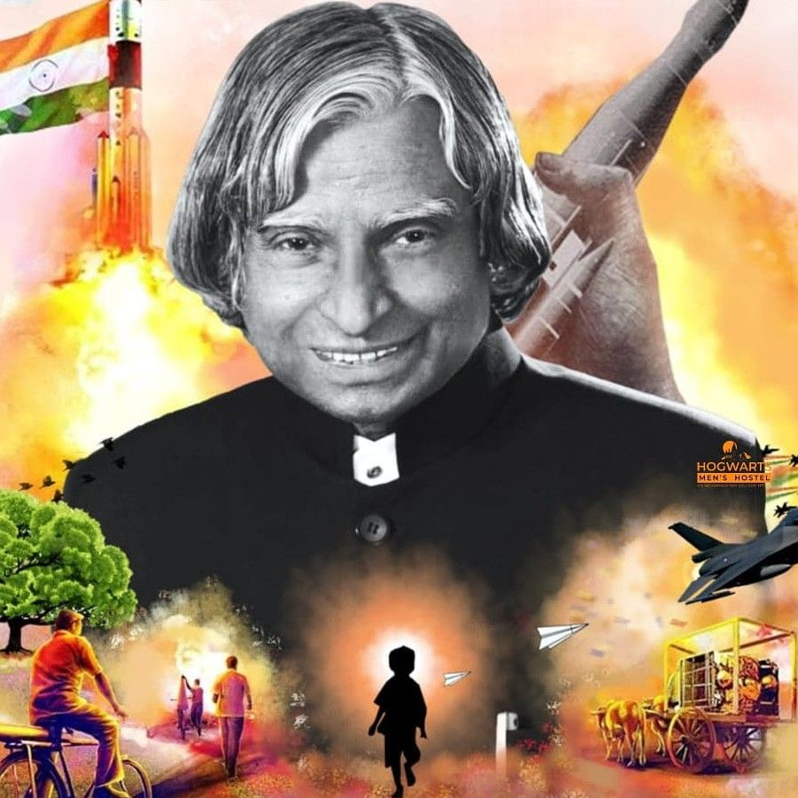

# Tribute Page - Dr. APJ Abdul Kalam

A clean, responsive tribute page dedicated to Dr. APJ Abdul Kalam, the "Missile Man of India" and former President of India. This project is part of the GeeksForGeeks HTML & CSS Projects series.



## 📋 Project Overview

This tribute page showcases the life and achievements of Dr. APJ Abdul Kalam through a modern, clean, and responsive design. The page features his biography, major achievements, and contributions to India's scientific and educational development.

## 🎯 Features

- **Clean and Modern Design**: Utilizes a minimalist design with white content boxes on a light gray background
- **Responsive Layout**: Adapts seamlessly to different screen sizes
- **Structured Content**: Well-organized sections for biography and achievements
- **SEO Optimized**: Includes relevant meta tags for better search engine visibility
- **Accessibility**: Proper HTML semantics and alt text for images

## 🛠️ Technical Details

### Technologies Used
- HTML5
- CSS3

### File Structure
```
Tribute Page/
├── index.html         # Main HTML file
├── style.css         # CSS styling file
├── img/             # Image assets directory
│   └── drapjimg.jpg  # Dr. Kalam's image
└── README.md        # Project documentation
```

### Implementation Details

#### HTML Structure
- Semantic HTML5 elements for better structure and SEO
- Organized sections for header, content, and footer
- Meta tags for SEO optimization
- Proper image alt text for accessibility

#### CSS Features
- Flexbox layout for responsive design
- Custom styling for different sections
- Consistent spacing and typography
- Rounded corners for modern look
- Responsive image sizing

## 🚀 Getting Started

1. Clone or download this repository
2. Open `index.html` in your web browser
3. No additional setup or dependencies required

## 💡 What I Learned

Through this project, I gained hands-on experience with several key web development concepts:

### HTML5
- Using semantic elements (`header`, `footer`, `section`) for better structure
- Implementing proper document structure with meta tags
- Writing SEO-friendly HTML with appropriate meta descriptions
- Creating accessible content with proper alt text and ARIA attributes
- Organizing content in a logical and meaningful way

### CSS3
- Building responsive layouts that work on all screen sizes
- Implementing a clean, modern design using:
  - Custom spacing and typography
  - Box-shadow and border-radius for modern aesthetics
- Creating consistent visual hierarchy through:
  - Typography scaling
  - Whitespace management
  - Color contrast
- Writing maintainable CSS with proper organization and comments

### Best Practices
- Mobile-first responsive design approach
- Web accessibility guidelines implementation
- Code organization and documentation
- Version control with Git
- Project documentation using Markdown

### Project Management
- Breaking down a design into implementable components
- Planning the project structure
- Writing comprehensive documentation
- Managing file organization
- Following coding standards and conventions

This project helped me understand how to create a complete, production-ready webpage from scratch while following modern web development best practices.

## ✍️ Author
Created by Gourav Rajak

## 📄 License
All rights reserved.

---
*This project is part of the GeeksForGeeks 10 HTML & CSS Projects series.*
